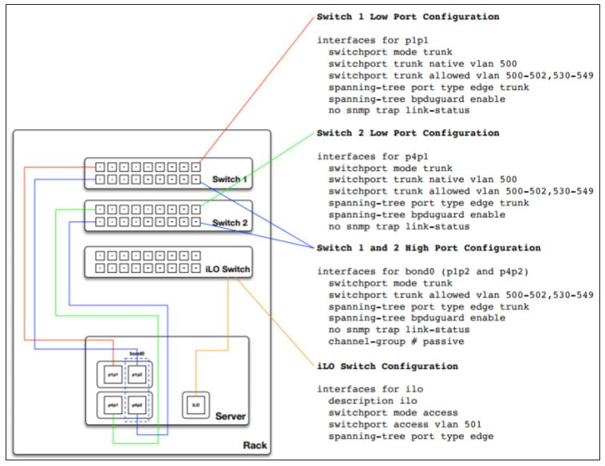

This section covers all the steps that are required for configuring the network interfaces,bonding, VLAN, and DNS of your nodes

## Switch Port Configuration

!!! Note
    The following example provides a good reference for switch configuration and cabinet layout. This example may be more than what is required for basic setups however it can be adjusted to just about any configuration. Additionally you will need to adjust the VLANS noted within this example to match your environment.

## Network CIDR/VLAN assignments

!!! note
    The VLAN IDs shown in the above figure  are  for the purpose of example only. You should change them to represent your requirements.

The following CIDR and VLAN assignments are used for this environment.
