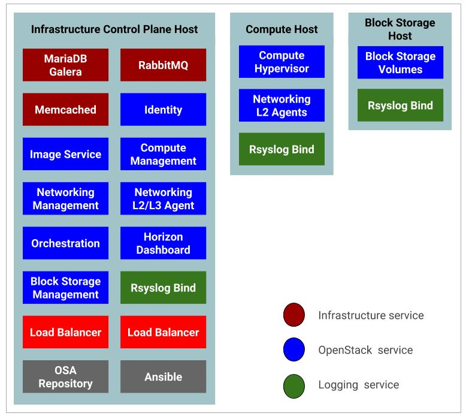

Here is an example test environment for a working OpenStack-Ansible (OSA) deployment with a small number of servers.

This example environment has the following characteristics:

- One infrastructure node for the **control plane** host (32 vCPU, 128 GB RAM, 2 TB RAID1 HDD)
- One compute node (32 vCPU, 128 GB RAM, 2 TB RAID1 HDD)
- One Storage node (2 vCPU,  64 GB RAM, 2 TB RAID1 HDD).
- Dual Port  Network Interface Card (NIC) for each host
- Internet access via the router address `192.168.10.1` on the Management Network

The following figure depicts this test environment and its components.



## Configuring the Network

OpenStack-Ansible uses bridges to connect physical and logical network interfaces on the host to virtual network interfaces within containers. Target hosts need to be configured with the following network bridges:


**Bridge name**| **Best configured on** |	**With a static IP**
-----------|-------------------|-------------------
`br-mgmt`	   | On every node |	Always
`br-storage` | On every storage node  |	When component is deployed on metal
           | On every compute node	| Always
`br-vxlan`	 | On every network node	| When component is deployed on metal
           | On every compute node| Always
`br-vlan`  	   | On every network node|	Never
           | On every compute node| Never

## Host Network Bridges Information

This section describes the Network Bridges used by OpenStack hosts

### LXC internal: `lxcbr0`

The `lxcbr0` bridge is required for LXC, but OpenStack-Ansible configures it automatically. It provides external (typically Internet) connectivity to containers with `dnsmasq (DHCP/DNS) + NAT`.

This bridge does not directly attach to any physical or logical interfaces on the host because `iptables` handles connectivity. It attaches to `eth0` in each container.

The container network that the bridge attaches to is configurable in the `openstack_user_config.yml` file in the provider_networks dictionary.

### Container management:`br-mgmt`

The `br-mgmt` bridge provides management of and communication between the infrastructure and OpenStack services.

The bridge attaches to a physical or logical interface, typically a `bond0 VLAN subinterface`. It also attaches to `eth1` in each container.

The container network interface that the bridge attaches to is configurable in the `openstack_user_config.yml` file.

### Storage:`br-storage`

The `br-storage` bridge provides segregated access to Block Storage devices between OpenStack services and Block Storage devices.

The bridge attaches to a physical or logical interface, typically a `bond0 VLAN subinterface`. It also attaches to `eth2` in each associated container.

The container network interface that the bridge attaches to is configurable in the `openstack_user_config.yml` file.

### OpenStack Networking tunnel:`br-vxlan`

The `br-vxlan` bridge is required if the environment is configured to allow projects to create virtual networks using `VXLAN`. It provides the interface for virtual (`VXLAN`) tunnel networks.

The bridge attaches to a physical or logical interface, typically a `bond1 VLAN subinterface`. It also attaches to `eth10` in each associated container.

The container network interface it attaches to is configurable in the `openstack_user_config.yml` file.

### OpenStack Networking provider:`br-vlan`

The `br-vlan` bridge is provides infrastructure for `VLAN` tagged or flat (no `VLAN` tag) networks.

The bridge attaches to a physical or logical interface, typically `bond1`. It attaches to `eth11` for VLAN type networks in each associated container. It is not assigned an IP address because it handles only layer 2 connectivity.

The container network interface that the bridge attaches to is configurable in the `openstack_user_config.yml` file.

## Network Architecture

In our test environment each has a dual port Ethernet card and we will configure our test environment network as a multiple interfaces as depicted by the diagram below.


## Network CIDR/VLAN Assignments

The following CIDR and VLAN assignments are used for this environment.

**Network**	           |        **CIDR**	   | **VLAN**
-----------------------|---------------------|-------------
Management Network     |	`172.29.236.0/22`	 | `10`
Tunnel (VXLAN) Network | 	`172.29.240.0/22`  | `30`
Storage Network        |	`172.29.244.0/22`  | `20`

## IP Assignments

The following host name and IP address assignments are used for this environment.

**Host name** |	**Management IP**  |	**Tunnel (VxLAN) I/P**  |	**Storage IP**
--------------|--------------------|--------------------------|--------------
`infra1`        |	`172.29.236.11`    |	`172.29.240.11`  	      | `172.29.244.11`
`compute1`	    | `172.29.236.12`    |	`172.29.240.12`         |	`172.29.244.12`
`storage1`	    | `172.29.236.13`    |	 `-`                    | `172.29.244.13`

##  Configuring the Operating System

This section covers how to install and configure **Ubuntu 18.04 LTS server** in our OpenStack-Ansible host.

## Install the Operating System

If your have downloaded your Ubuntu server image download the installation ISO from alternate download section.

### Alternative Ubuntu Server installer

Since we  require advanced networking and storage features such as; LVM, RAID, multipath, vlans, bonds, or re-using existing partitions, you will want to continue to use the alternate installer. Pannipitiya

[Download the alternate installer](http://cdimage.ubuntu.com/releases/18.04.2/release/ubuntu-18.04.2-server-amd64.iso)

### Suggested Partitions Scheme for OpenStack Nodes.

We  recommend you the following partitions scheme for your node installation. We will be using LVM devices created on a Volume Group by the short  hostname (`hostname -s`) of the system. For example `vg_infra1`  for `infra1`.

**Device** | **Size** | **Type**|**Mount Point**
-----------|----------|---------|--------------
`/dev/vg_infra1/lv_boot` | `200MB` | `EXT4` | `/boot`
`/dev/vg_infra1/lv_swap` | `RAM+2G` | `EXT4` | `none`
`/dev/vg_infra1/lv_root` | `100G` | `EXT4` | `/`

You need to apply the same above  for the `compute1` and `storage1` nodes as well.

!!! Important "Setting root access in Ubuntu"
    During the default installation of `Ubuntu` server we do not have an option for setting `root password`. Suggested `admin` account during the installation is `ostack` with password of your choice. Once the installation is over logging to your admin account and set a password for the `root` account. Also enable `PermitRootLogin yes` in `/etc/ssh/sshd_config` to enable `root` access via `ssh` as we require it during the deployment via Ansible play playbooks

!!! Info "Remaining space of the OS disk"
    Keep the remaining space in-allocated since we are going to use them later for few other uses

!!! Note "Installing Ubuntu Server"
    We do not cover on how to install the Ubuntu server here. We assume that you already know howto do it.

!!! Important "Language and locales setting"
    We also recommend setting your locale to en_US.UTF-8. Other locales might work, but they are not tested or supported. [If you don't know howto do it](https://help.ubuntu.com/community/Locale)

### Configure Ubuntu

**1\.** Update package source lists
```
sudo apt-get update
```
**2\.** Upgrade the system packages and kernel:
```
sudo apt-get dist-upgrade
```
**3\.** Reboot the host.
```
sudo systemctl reboot
```
**4\.** Ensure that the kernel version is `3.13.0-34-generic` or later:
```
uname -r .

```
**5\.** Install additional software packages:
```
sudo apt-get install bridge-utils debootstrap ifenslave ifenslave-2.6 lsof lvm2 chrony openssh-server sudo tcpdump vlan python
```
**6\.**  Install the kernel extra package if you have one for your kernel version
```
sudo apt install linux-image-extra-$(uname -r)
```
**7\.** Add the appropriate kernel modules to the `/etc/modules` file to enable VLAN and bond interfaces:
```
sudo echo 'bonding' >> /etc/modules && sudo  echo '8021q' >> /etc/modules
```
**8\.** Configure Network Time Protocol (NTP) in `/etc/chrony/chrony.conf` to synchronize with a suitable time source and restart the service:
```
sudo systemctl enable chrony
sudo restart chrony
```

**9\.** Reboot the host to activate the changes and use the new kernel.
```
sudo systemctl reboot
```

##  Configure The Network  Interfaces.

This secti Pannipitiyaon describes how to configure network interfaces of your host so that it can be used in OpenStack Ansible deployment.

### Changing `netplan` to `ifupdown`

The classic `ifupdown` network configuration used in Debian/Ubuntu  has been replaced by `netplan` on Ubuntu 18.04 server system.

You can view the current `netplan` configuration using  the command below. You may have a different name for your `YML` as per your installation environment.

```
cat /etc/netplan/01-netcfg.yaml
```

You will get an output like below.

```
# This file describes the network interfaces available on your system
# For more information, see netplan(5).
network:
  version: 2
  renderer: networkd
  ethernets:
    enp0s3:
      dhcp4: yes
```   
To re-enable `ifupdown` on this system, run:
```
sudo apt install ifupdown
```                                        
### Consistent Naming for Network Interfaces

New versions of Linux Kernel, including the one in our Ubuntu server name the network interfaces using a new convention based on the network interface type (PCI, PCIe, Onboard, Wireless, etc.,) and the relative position of the motherboard which we have slotted the specific card. For example, you may get interface names like `enp0s3, eno1, p2p1` etc. While this is an advantageous in many cases as it provides consist ant name of each interface during our OpenStack-Ansible deployment we are going to rename them back to our traditional naming convention `eth0, eth1`, and so on.

To get back to `ethX` again will do the following configurations

```
sudo nano /etc/default/grub
```
Look for `GRUB_CMDLINE_LINUX`  and add the following `net.ifnames=0 biosdevname=0`.

**From:**
```
GRUB_CMDLINE_LINUX=""
```
**To:**

```
GRUB_CMDLINE_LINUX="net.ifnames=0 biosdevname=0"
```
Generate a new grub file using the following command.
```
sudo grub-mkconfig -o /boot/grub/grub.cfg
```
Now reboot your systems

```
sudo systemctl reboot
```
Now check your interface name:
```
ip link show
```
You should get an output like below:
```
1: lo: <LOOPBACK,UP,LOWER_UP> mtu 65536 qdisc noqueue state UNKNOWN mode DEFAULT group default qlen 1000
    link/loopback 00:00:00:00:00:00 brd 00:00:00:00:00:00
2: eth0: <BROADCAST,MULTICAST,UP,LOWER_UP> mtu 1500 qdisc fq_codel state UP mode DEFAULT group default qlen 1000
    link/ether 08:00:27:cb:31:f1 brd ff:ff:ff:ff:ff:ff
3: eth1: <BROADCAST,MULTICAST,UP,LOWER_UP> mtu 1500 qdisc fq_codel state UP mode DEFAULT group default qlen 1000
    link/ether 08:00:27:b4:05:38 brd ff:ff:ff:ff:ff:ff
```

### Infra1 Host Networking

According to above network architecture and design you can configure the network interfaces of infra1 host as below.

```
sudo nano /etc/network/interfaces
```
Add the the following configurations.

```
# Physical interfaces
auto eth0
iface eth0 inet manual

auto eth1
iface eth1 inet manual

# Container/Host management VLAN interface
auto eth0.10
iface eth0.10 inet manual
    vlan-raw-device eth0

# OpenStack Networking VXLAN (tunnel/overlay) VLAN interface
auto eth1.30
iface eth1.30 inet manual
    vlan-raw-device eth1

# Storage network VLAN interface (optional)
auto eth0.20
iface eth0.20 inet manual
    vlan-raw-device eth0

# Container/Host management bridge
auto br-mgmt
iface br-mgmt inet static
    bridge_stp off
    bridge_waitport 0
    bridge_fd 0
    bridge_ports eth0.10
    address 172.29.236.11
    netmask 255.255.252.0
    dns-nameservers 8.8.8.8 8.8.4.4

# Bind the Internal LB VIP as we run haproxy without keepalived
auto br-mgmt:0
iface br-mgmt:0 inet static
    address 172.29.236.10
    netmask 255.255.252.0

# Bind the External LB VIP as we run haproxy without keepalived
auto eth1:0
iface eth1:0 inet static
    address 192.168.10.10
    netmask 255.255.255.0

# External Network access for Floating IP
auto eth1
face eth1 inet static
   address 192.168.10.11
   netmask 255.255.255.0
   gateway 192.168.10.1
   dns-nameservers 8.8.8.8 8.8.4.4

# OpenStack Networking VXLAN (tunnel/overlay) bridge
#
# The COMPUTE, NETWORK and INFRA nodes must have an IP address
# on this bridge.
#
auto br-vxlan
iface br-vxlan inet static
    bridge_stp off
    bridge_waitport 0
    bridge_fd 0
    bridge_ports eth1.30
    address 172.29.240.11
    netmask 255.255.252.0

# OpenStack Networking VLAN bridge
auto br-vlan
iface br-vlan inet manual
    bridge_stp off
    bridge_waitport 0
    bridge_fd 0
    bridge_ports eth1

# Storage bridge (optional)
#
# Only the COMPUTE and STORAGE nodes must have an IP address
# on this bridge. When used by infrastructure nodes, the
# IP addresses are assigned to containers which use this
# bridge.Deploying and customizing OpenStack Mitaka with openstack-ansible
#
# Storage bridge
auto br-storage
iface br-storage inet static
    bridge_stp off
    bridge_waitport 0
    bridge_fd 0
    bridge_ports eth0.20
    address 172.29.244.11
    netmask 255.255.252.0
```
Reboot the system
```
sudo systemctl reboot
```

###  Compute1 Host Networking

According to above network architecture and design you can configure the network interfaces of Compute1 host as below.

```
sudo nano /etc/network/interfaces
```
Add the the following configurations.

```
# Physical interfaces
auto eth0
iface eth0 inet manual

auto eth1
iface eth1 inet manual

# Container/Host management VLAN interface
auto eth0.10
iface eth0.10 inet manual
    vlan-raw-device eth0

# OpenStack Networking VXLAN (tunnel/overlay) VLAN interface
auto eth1.30
iface eth1.30 inet manual
    vlan-raw-device eth1

# Storage network VLAN interface (optional)
auto eth0.20
iface eth0.20 inet manual
    vlan-raw-device eth0

# Container/Host management bridge
auto br-mgmt
iface br-mgmt inet static
    bridge_stp off
    bridge_waitport 0
    bridge_fd 0
    bridge_ports eth0.10
    address 172.29.236.12
    netmask 255.255.252.0
    gateway 172.29.236.1
    dns-nameservers 8.8.8.8 8.8.4.4

# External Network access for Floating IP
auto eth1
face eth1 inet static
   address 192.168.10.12
   netmask 255.255.255.0
   gateway 192.168.10.1
   dns-nameservers 8.8.8.8 8.8.4.4

# OpenStack Networking VXLAN (tunnel/overlay) bridge
#
# The COMPUTE, NETWORK and INFRA nodes must have an IP address
# on this bridge.
#
auto br-vxlan
iface br-vxlan inet static
    bridge_stp off
    bridge_waitport 0
    bridge_fd 0
    bridge_ports eth1.30
    address 172.29.240.12
    netmask 255.255.252.0

# OpenStack Networking VLAN bridge
auto br-vlan
iface br-vlan inet manual
    bridge_stp off
    bridge_waitport 0
    bridge_fd 0
    bridge_ports eth1

# For tenant vlan support, create a veth pair to be used when the neutron
# agent is not containerized on the compute hosts. 'eth12' is the value used on
# the host_bind_override parameter of the br-vlan network section of the
# openstack_user_config example file. The veth peer name must match the value
# specified on the host_bind_override parameter.
#
# When the neutron agent is containerized it will use the container_interface
# value of the br-vlan network, which is also the same 'eth12' value.
#
# Create veth pair, do not abort if already exists
#    pre-up ip link add br-vlan-veth type veth peer name eth12 || true
# Set both ends UP
#    pre-up ip link set br-vlan-veth up
#    pre-up ip link set eth12 up
# Delete veth pair on DOWN
#    post-down ip link del br-vlan-veth || true
#    bridge_ports eth0 br-vlan-veth

# Storage bridge (optional)
#
# Only the COMPUTE and STORAGE nodes must have an IP address
# on this bridge. When used by infrastructure nodes, the
# IP addresses are assigned to containers which use this
# bridge.Deploying and customizing OpenStack Mitaka with openstack-ansible
#
# Storage bridge
auto br-storage
iface br-storage inet static
    bridge_stp off
    bridge_waitport 0
    bridge_fd 0
    bridge_ports eth0.20
    address 172.29.244.12
    netmask 255.255.252.0
```
Reboot the system

```
sudo systemctl reboot
```
###  Storage1 Host Networking

According to above network architecture and design you can configure the network interfaces of Host1 host as below.

```
sudo nano /etc/network/interfaces
```
Add the the following configurations.

```
# Physical interfaces
auto eth0
iface eth0 inet manual

auto eth1
iface eth1 inet manual

# Container/Host management VLAN interface
auto eth0.10
iface eth0.10 inet manual
    vlan-raw-device eth0

# OpenStack Networking VXLAN (tunnel/overlay) VLAN interface
auto eth1.30
iface eth1.30 inet manual
    vlan-raw-device eth1

# Storage network VLAN interface (optional)
auto eth0.20
iface eth0.20 inet manual
    vlan-raw-device eth0

# Container/Host management bridge
auto br-mgmt
iface br-mgmt inet static
    bridge_stp off
    bridge_waitport 0
    bridge_fd 0
    bridge_ports eth0.10
    address 172.29.236.13
    netmask 255.255.252.0
    gateway 172.29.236.1
    dns-nameservers 8.8.8.8 8.8.4.4

# Storage bridge
auto br-storage
iface br-storage inet static
    bridge_stp off
    bridge_waitport 0
    bridge_fd 0
    bridge_ports eth0.20
    address 172.29.244.13
    netmask 255.255.252.0
```

Reboot the system

```
sudo systemctl reboot
```
## Configure SSH keys

Ansible uses SSH to connect the deployment host and target hosts.

In this test environment we use `infra1` host as  our `OpenStack-ansible` host we will create a `ssh` key pair as the root user and propagate the public key of the root user to `compute1` and `storage1` hosts.

**1\.** 'Run the following command as `root` user in `infra1` host

```
sudo su -
ssh-keygen -t rsa
```
Press `Enter` key to create our keys without a passphrase

You will get an output like below.

```Note

OpenStack-Ansible automatically configures LVM on the nodes, and overrides any existing LVM configuration. If you had a customized LVM configuration, edit the generated configuration file as needed.


root@guru:~# ssh-keygen -t rsa
Generating public/private rsa key pair.
Enter file in which to save the key (/root/.ssh/id_rsa):
Enter passphrase (empty for no passphrase):
Enter same passphrase again:
Your identification has been saved in /root/.ssh/id_rsa.
Your public key has been saved in /root/.ssh/id_rsa.pub.
The key fingerprint is:
SHA256:WpPMnxdgptMOBoV+qcSgO8qQDWZjtEtfmsB08A5Zr6s root@guru
The key's randomart image is:
+---[RSA 2048]----+
| ...   ..        |
| o+.o ..         |
|+ooo =.  .+      |
|.X+ ..++o* .     |
|=+=++. oS . .    |
|o.++. .+ * . .   |
|o. o  .   + .    |
|...        .     |
| E               |
+----[SHA256]-----+
```

**2\.** Copy the keys to compute1 and storage1 hosts.
```
ssh-copy-id root@compute1
ssh-copy-id root@storage1
```

!!! Note
    We assume that  you have configured your DNS or at least `/etc/hosts` file to resolve hostnames

**3\.** Test it
```
ssh root@compute1
ssh root@Storage1
```
If you can connect and get the shell without authenticating, it is working. SSH provides a shell without asking for a password.

!!! Note

    OpenStack-Ansible automatically configures LVM on the nodes, and overrides any existing LVM configuration. If you had a customized LVM configuration, edit the generated configuration file as needed.

!!! Important
    OpenStack-Ansible deployments require the presence of a `/root/.ssh/id_rsa.pub` file on the deployment host. The contents of this file is inserted into an `authorized_keys` file for the containers, which is a necessary step for the Ansible playbooks. You can override this behavior by setting the `lxc_container_ssh_key` variable to the public key for the container.

## Configuring The Storage

Logical Volume Manager (LVM) enables a single device to be split into multiple logical volumes that appear as a physical storage device to the operating system. The Block Storage (cinder) service, and LXC containers that optionally run the OpenStack infrastructure, can optionally use LVM for their data storage.

!!! Note "Configuring LVM"
    OpenStack-Ansible automatically configures LVM on the nodes, and overrides any existing LVM configuration. If you had a customized LVM configuration, edit the generated configuration file as needed.

1\. To use the optional Block Storage (cinder) service, create an LVM volume group named `cinder-volumes` on the storage host. Specify a metadata size of `2048` when creating the physical volume.  For example:
```
sudo pvcreate --metadatasize 2048  physical_volume_device_path (/dev/sda5)
sudo  vgcreate cinder-volumes physical_volume_device_path (/dev/sda5)
```
2\. Optionally, create an LVM volume group named `lxc` for container file systems if you want to use `LXC` with `LVM`. If the `lxc` volume group does not exist, containers are automatically installed on the file system under `/var/lib/lxc` by default.

### Setup DNS Resolver

Ubuntu 18.04 systems make a symlink to ``/etc/resolv.conf` with `../run/systemd/resolve/stub-resolv.conf` by default.

1\. Remove symlink
```
sudo rm -f /etc/resolv.conf
```
2. Create the Resolver
```
sudo echo "nameserv*er 8.8.8.8" > /etc/resolv.conf
```
3\. Test it
```
ping -c4 google.command
```
4\. Carry out above in all openstack hosts.

## Setup NAT Gateway.

In our test environment setup `infra1` host will be used as the Ansible host and it will also act as the gateway for OpenStack Ansible lxc lxc_containers. Let's to the following configurations to get this done.

1\. Enable IP Forwarding
```
sudo echo "net.ipv4.ip_forward=1" >> /etc/sysctl.conf
```
2\. Update without rebooting
```
sudo sysctl -p
```
3\. Create a Masquerading rule to enable SNAT
```
sudo iptables -t nat -A POSTROUTING -j MASQUERADE
```
4\. Save your rules
```
sudo mkdir -p /etc/iptables
sudo sudo iptables-save > /etc/iptables/rules.v4
```
5\. You can automate the restore process at reboot by installing an additional package for `iptables` which takes over the loading of the saved rules. To do this install the following command.
```
sudo apt-get install iptables-persistent
```
!!! Note
    After the installation the initial setup will ask to save the current rules for `IPv4` and `IPv6`, just select `Yes` and press `enter` for both.

!!! Important
    If you make further changes to your `iptables` rules, remember to save them again using the  command in the step 4 above. The `iptables-persistent` looks for the files `rules.v4` and `rules.v6` under `/etc/iptables`.

## Setup  OpenStack Ansible Host

In this example environment  we use `infra1` node  as the 'openstack-anible' host.

Execute the following commands in infra1 host.

1\. Update package source lists:
```
sudo apt-get update
```

2\. Upgrade the system packages and kernel:
```
sudo apt-get dist-upgrade
```

3\. Reboot the host.
```
sudo system reboot
```

4\. Install additional software packages if they were not installed during the operating system installation:

```
sudo apt-get install aptitude build-essential git ntp ntpdate openssh-server python-dev sudo
```

## Install the Source and Dependencies

Install the source and dependencies for the deployment host.

1\. Clone the latest stable release of the OpenStack-Ansible Git repository in the `/opt/openstack-ansible` directory:

```
sudo su -
git clone -b 18.1.4 https://git.openstack.org/openstack/openstack-ansible /opt/openstack-ansible
```
2\. Change to the `/opt/openstack-ansible` directory, and run the Ansible bootstrap script:
```
cd /opt/openstack-ansible
scripts/bootstrap-ansible.sh
```
## Deployment Configuration

### Environment Layout

The `/etc/openstack_deploy/openstack_user_config.yml` file defines the environment layout.

The following configuration describes the layout for this environment.

!!! Example "`/etc/openstack_deploy/openstack_user_config.yml`"

    ```
    ---
    cidr_networks:
      container: 172.29.236.0/22
      tunnel: 172.29.240.0/22
      storage: 172.29.244.0/22

    used_ips:
      - "172.29.236.1,172.29.236.50"
      - "172.29.240.1,172.29.240.50"
      - "172.29.244.1,172.29.244.50"
      - "172.29.248.1,172.29.248.50"

    global_overrides:
      # The internal and external VIP should be different IPs, however they
      # do not need to be on separate networks.
      # In this confuration osatest.nic.lk should  have an A record
      # pointing to 192.168.10.10

      external_lb_vip_address: osatest.nic.lk
      internal_lb_vip_address: 172.29.236.10
      management_bridge: "br-mgmt"
      provider_networks:
        - network:
            container_bridge: "br-mgmt"
            container_type: "veth"
            container_interface: "eth1"
            ip_from_q: "container"
            type: "raw"
            group_binds:
              - all_containers
              - hosts
            is_container_address: true
        - network:
            container_bridge: "br-vxlan"
            container_type: "veth"
            container_interface: "eth10"
            ip_from_q: "tunnel"
            type: "vxlan"
            range: "1:1000"
            net_name: "vxlan"
            group_binds:
              - neutron_linuxbridge_agent
        - network:
            container_bridge: "br-vlan"
            container_type: "veth"
            container_interface: "eth12"
            host_bind_override: "eth12"
            typenfo: "flat"
            net_name: "flat"
            group_binds:
              - neutron_linuxbridge_agent
        - network:
            container_bridge: "br-vlan"
            container_type: "veth"
            container_interface: "eth11"
            type: "vlan"
            range: "101:200,301:400"
            net_name: "vlan"
            group_binds:
              - neutron_linuxbridge_agent
        - network:
            container_bridge: "br-storage"
            container_type: "veth"
            container_interface: "eth2"
            ip_from_q: "storage"
            type: "raw"
            group_binds:
              - glance_api
              - cinder_api
              - cinder_volume
              - nova_compute
    ###
    ### Infrastructure
    ###

    # galera, memcache, rabbitmq, utility
    shared-infra_hosts:
      infra1:
        ip: 172.29.236.11

    # repository (apt cache, python packages, etc)
    repo-infra_hosts:
      infra1:
        ip: 172.29.236.11

    # load balancer
    haproxy_hosts:
      infra1:
        ip: 172.29.236.11

    ###
    ### OpenStack
    ###

    # keystone
    identity_hosts:
      infra1:
        ip: 172.29.236.11

    # cinder api services
    storage-infra_hosts:
      infra1:
        ip: 172.29.236.11

    # glance
    image_hosts:
      infra1:
        ip: 172.29.236.11

    # nova api, conductor, etc services
    compute-infra_hosts:
      infra1:
        ip: 172.29.236.11

    # heat
    orchestration_hosts:
      infra1:
        ip: 172.29.236.11

    # horizon
    dashboard_hosts:
      infra1:
        ip: 172.29.236.11

    # neutron server, agents (L3, etc)
    network_hosts:
      infra1:
        ip: 172.29.236.11

    # nova hypervisors
    compute_hosts:
      compute1:
        ip: 172.29.236.12

    # cinder storage host (LVM-backed)
    storage_hosts:
      storage1:
        ip: 172.29.236.13
        container_vars:
          cinder_backends:
            limit_container_types: cinder_volume
            lvm:
              volume_group: cinder-volumes
              volume_driver: cinder.volume.drivers.lvm.LVMVolumeDriver
              volume_backend_name: LVM_iSCSI
              iscsi_ip_address: "172.29.244.13"
    ```

## More Details on: `openstack_user_config.yml` YAML file

!!! Note "`cidr_networks:`"

    ```
    cidr_networks:  
      container: 172.29.236.0/22
      tunnel: 172.29.240.0/22
      storage: 172.29.244.0/22
    ```
    These are the networks where our containers, tunnel/overlay and storage network will build from. These can be whatever you need as long as they are large enough and correspond to the IPs you configure on your `br-mgmt` (container), `br-vxlan` (tunnel/overlay) and `br-storage` (storage) interfaces on each host.

!!! Note "used_ips:"

    ```
    used_ips:  
      - "172.29.236.1,172.29.236.255"
      - "172.29.240.1,172.29.240.255"
      - "172.29.244.1,172.29.244.255"
    ```
    Here we define some IPs that we do not want `openstack-ansible` to use. These IPs are already being used on our hosts, other devices or we just want to reserve these for future expansion. When openstack-ansible creates our containers it automatically assigns them an IP out of the container network. Our internal `VIP` and physical hosts already have IPs out of these ranges so we put these in used_ips to avoid duplicate IP problems. Out of a /22 network we reserve the first 255 addresses. Based on your network you might need to add more ranges or even single IPs for network gear etc.

!!! Note "global_overrides:"
    ```
    global_overrides:
      # The internal and external VIP should be different IPs, however they
      # do not need to be on separate networks.
      external_lb_vip_address: 192.168.10.10
      internal_lb_vip_address: 172.29.236.10
      management_bridge: "br-mgmt"
    ```
    Most important are the internal and external VIPs. These will be our `OpenStack internal/public/admin endpoints all services and clients` will be using. We want our internal VIP to be an IP out of the `br-mgmt` network so all hosts/containers can access it. Our external VIP can be a true public IP or a private IP that you have access to in your larger network.

    
